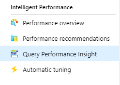
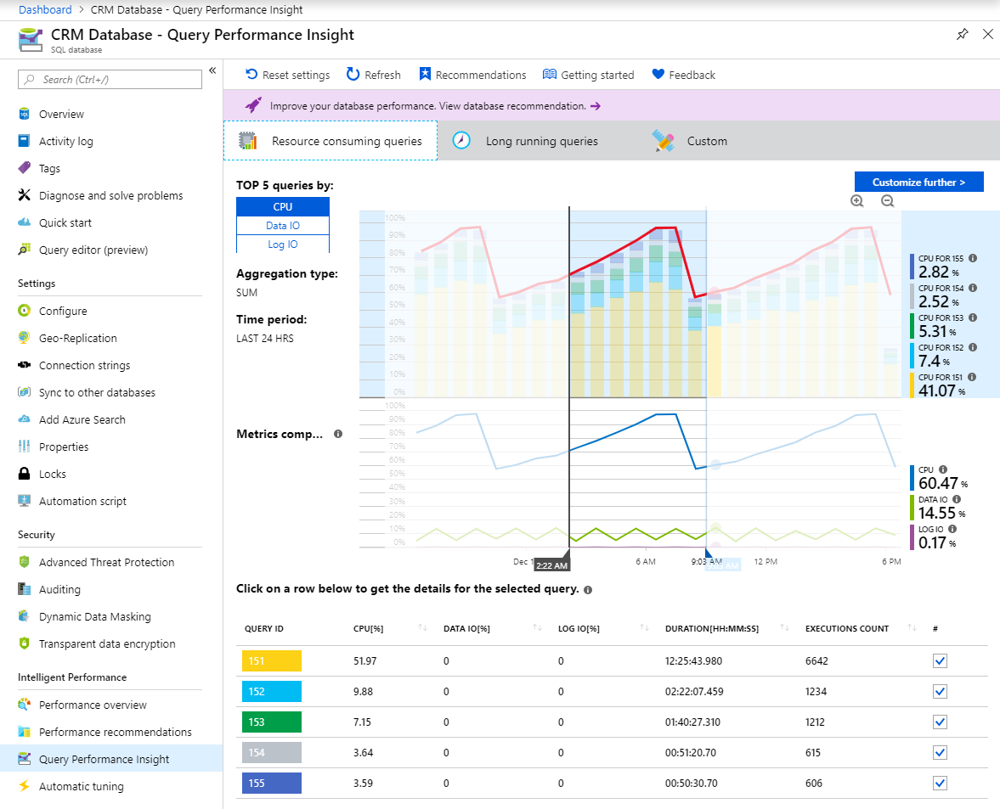
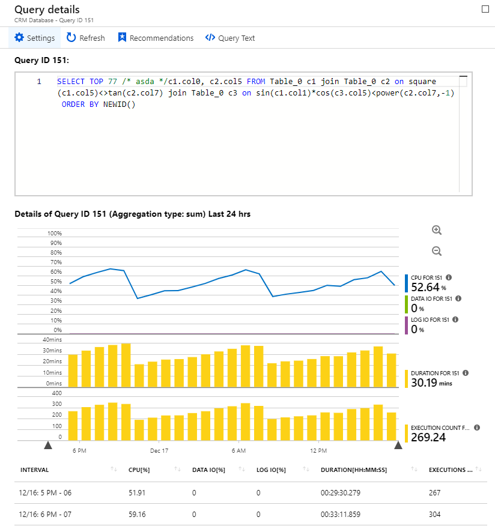
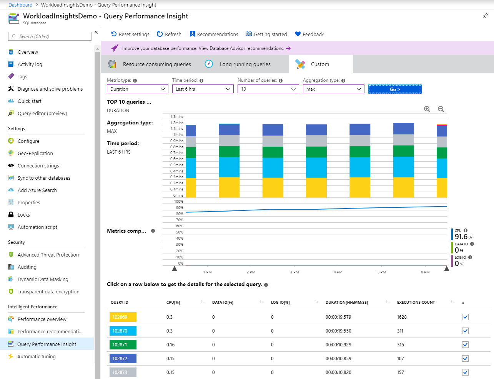
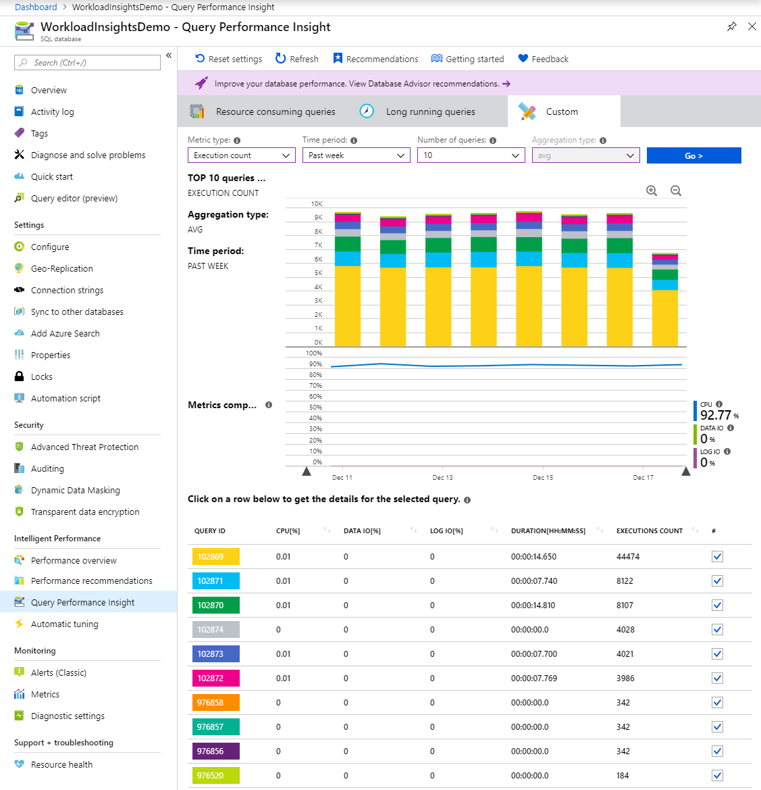
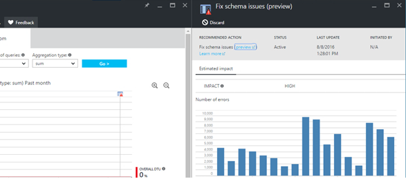
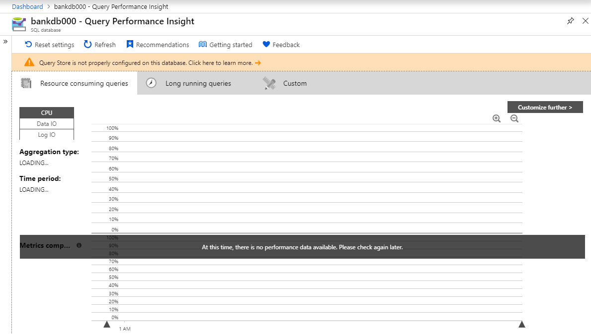

# Query Performance Insight for Azure SQL Database
[!INCLUDE[appliesto-sqldb](../includes/appliesto-sqldb.md)]

Query Performance Insight provides intelligent query analysis for single and pooled databases. It helps identify the top resource consuming and long-running queries in your workload. This helps you find the queries to optimize to improve overall workload performance and efficiently use the resource that you are paying for. Query Performance Insight helps you spend less time troubleshooting database performance by providing:

* Deeper insight into your databases resource (DTU) consumption
* Details on top database queries by CPU, duration, and execution count (potential tuning candidates for performance improvements)
* The ability to drill down into details of a query, to view the query text and history of resource utilization
* Annotations that show performance recommendations from [database advisors](database-advisor-implement-performance-recommendations.md)


## Prerequisites

Query Performance Insight requires that [Query Store](/sql/relational-databases/performance/monitoring-performance-by-using-the-query-store) is active on your database. It's automatically enabled for all databases in Azure SQL Database by default. If Query Store is not running, the Azure portal will prompt you to enable it.

> [!NOTE]
> If the "Query Store is not properly configured on this database" message appears in the portal, see [Optimizing the Query Store configuration](#optimize-the-query-store-configuration).

## Permissions

You need the following [Azure role-based access control (Azure RBAC)](/azure/role-based-access-control/overview) permissions to use Query Performance Insight:

* **Reader**, **Owner**, **Contributor**, **SQL DB Contributor**, or **SQL Server Contributor** permissions are required to view the top resource-consuming queries and charts.
* **Owner**, **Contributor**, **SQL DB Contributor**, or **SQL Server Contributor** permissions are required to view query text.

## Use Query Performance Insight

Query Performance Insight is easy to use:

1. Open the [Azure portal](https://portal.azure.com/) and find a database that you want to examine.
2. From the left-side menu, open **Intelligent Performance** > **Query Performance Insight**.
  
   

3. On the first tab, review the list of top resource-consuming queries.
4. Select an individual query to view its details.
5. Open **Intelligent Performance** > **Performance recommendations** and check if any performance recommendations are available. For more information on built-in performance recommendations, see [Azure SQL Database Advisor](database-advisor-implement-performance-recommendations.md).
6. Use sliders or zoom icons to change the observed interval.

   

> [!NOTE]
> For Azure SQL Database to render the information in Query Performance Insight, Query Store needs to capture a couple hours of data. If the database has no activity or if Query Store was not active during a certain period, the charts will be empty when Query Performance Insight displays that time range. You can enable Query Store at any time if it's not running. For more information, see [Best practices with Query Store](/sql/relational-databases/performance/best-practice-with-the-query-store).
>

For database performance recommendations, select [Recommendations](database-advisor-implement-performance-recommendations.md) on the Query Performance Insight navigation blade.


## Review top CPU-consuming queries

By default, Query Performance Insight shows the top five CPU-consuming queries when you first open it.

1. Select or clear individual queries to include or exclude them from the chart by using check boxes.

   The top line shows overall DTU percentage for the database. The bars show CPU percentage that the selected queries consumed during the selected interval. For example, if **Past week** is selected, each bar represents a single day.

   

   > [!IMPORTANT]
   > The DTU line shown is aggregated to a maximum consumption value in one-hour periods. It's meant for a high-level comparison only with query execution statistics. In some cases, DTU utilization might seem too high compared to executed queries, but this might not be the case.
   >
   > For example, if a query maxed out DTU to 100% for a few minutes only, the DTU line in Query Performance Insight will show the entire hour of consumption as 100% (the consequence of the maximum aggregated value).
   >
   > For a finer comparison (up to one minute), consider creating a custom DTU utilization chart:
   >
   > 1. In the Azure portal, select **Azure SQL Database** > **Monitoring**.
   > 2. Select **Metrics**.
   > 3. Select **+Add chart**.
   > 4. Select the DTU percentage on the chart.
   > 5. In addition, select **Last 24 hours** on the upper-left menu and change it to one minute.
   >
   > Use the custom DTU chart with a finer level of details to compare with the query execution chart.

   The bottom grid shows aggregated information for the visible queries:

   * Query ID, which is a unique identifier for the query in the database.
   * CPU per query during an observable interval, which depends on the aggregation function.
   * Duration per query, which also depends on the aggregation function.
   * Total number of executions for a specific query.

2. If your data becomes stale, select the **Refresh** button.

3. Use sliders and zoom buttons to change the observation interval and investigate consumption spikes:

   

4. Optionally, you can select the **Custom** tab to customize the view for:

   * Metric (CPU, duration, execution count).
   * Time interval (last 24 hours, past week, or past month).
   * Number of queries.
   * Aggregation function.
  
   
  
5. Select the **Go >** button to see the customized view.

   > [!IMPORTANT]
   > Query Performance Insight is limited to displaying the top 5-20 consuming queries, depending on your selection. Your database can run many more queries beyond the top ones shown, and these queries will not be included on the chart.
   >
   > There might exist a database workload type in which lots of smaller queries, beyond the top ones shown, run frequently and use the majority of DTU. These queries don't appear on the performance chart.
   >
   > For example, a query might have consumed a substantial amount of DTU for a while, although its total consumption in the observed period is less than the other top-consuming queries. In such a case, resource utilization of this query would not appear on the chart.
   >
   > If you need to understand top query executions beyond the limitations of Query Performance Insight, consider using [Azure SQL Insights](/azure/azure-monitor/insights/sql-insights-overview) for advanced database performance monitoring and troubleshooting.
   > 

## View individual query details

To view query details:

1. Select any query in the list of top queries.

    

   A detailed view opens. It shows the CPU consumption, duration, and execution count over time.

2. Select the chart features for details.

   * The top chart shows a line with the overall database DTU percentage. The bars are the CPU percentage that the selected query consumed.
   * The second chart shows the total duration of the selected query.
   * The bottom chart shows the total number of executions by the selected query.

   

3. Optionally, use sliders, use zoom buttons, or select **Settings** to customize how query data is displayed, or to pick a different time range.

   > [!IMPORTANT]
   > Query Performance Insight does not capture any DDL queries. In some cases, it might not capture all ad hoc queries.
   > 
   > In case your database is scope locked with a read-only lock, query details blade will not be able to load.
   >

## Review top queries per duration

Two metrics in Query Performance Insight can help you find potential bottlenecks: duration and execution count.

Long-running queries have the greatest potential for locking resources longer, blocking other users, and limiting scalability. They're also the best candidates for optimization. For more information, see [Understand and resolve Azure SQL blocking problems](understand-resolve-blocking.md).

To identify long-running queries:

1. Open the **Custom** tab in Query Performance Insight for the selected database.
2. Change the metrics to **duration**.
3. Select the number of queries and the observation interval.
4. Select the aggregation function:

   * **Sum** adds up all query execution time for the whole observation interval.
   * **Max** finds queries in which execution time was maximum for the whole observation interval.
   * **Avg** finds the average execution time of all query executions and shows you the top ones for these averages.

   

5. Select the **Go >** button to see the customized view.

   > [!IMPORTANT]
   > Adjusting the query view does not update the DTU line. The DTU line always shows the maximum consumption value for the interval.
   >
   > To understand database DTU consumption with more detail (up to one minute), consider creating a custom chart in the Azure portal:
   >
   > 1. Select **Azure SQL Database** > **Monitoring**.
   > 2. Select **Metrics**.
   > 3. Select **+Add chart**.
   > 4. Select the DTU percentage on the chart.
   > 5. In addition, select **Last 24 hours** on the upper-left menu and change it to one minute.
   >
   > We recommend that you use the custom DTU chart to compare with the query performance chart.
   >

## Review top queries per execution count

A user application that uses the database might get slow, even though a high number of executions might not be affecting the database itself and resources usage is low.

In some cases, a high execution count can lead to more network round trips. Round trips affect performance. They're subject to network latency and to downstream server latency.

For example, many data-driven websites heavily access the database for every user request. Although connection pooling helps, the increased network traffic and processing load on the server can slow performance. In general, keep round trips to a minimum.

To identify frequently executed ("chatty") queries:

1. Open the **Custom** tab in Query Performance Insight for the selected database.
2. Change the metrics to **execution count**.
3. Select the number of queries and the observation interval.
4. Select the **Go >** button to see the customized view.

   

## Understand performance tuning annotations

While exploring your workload in Query Performance Insight, you might notice icons with a vertical line on top of the chart.

These icons are annotations. They show performance recommendations from [Azure SQL Database Advisor](database-advisor-implement-performance-recommendations.md). By hovering over an annotation, you can get summarized information on performance recommendations.

   

If you want to understand more or apply the advisor's recommendation, select the icon to open details of the recommended action. If this is an active recommendation, you can apply it right away from the portal.

   

In some cases, due to the zoom level, it's possible that annotations close to each other are collapsed into a single annotation. Query Performance Insight represents this as a group annotation icon. Selecting the group annotation icon opens a new blade that lists the annotations.

Correlating queries and performance-tuning actions might help you to better understand your workload.

## Optimize the Query Store configuration

While using Query Performance Insight, you might see the following Query Store error messages:

* "Query Store is not properly configured on this database. Click here to learn more."
* "Query Store is not properly configured on this database. Click here to change settings."

These messages usually appear when Query Store can't collect new data.

The first case happens when Query Store is in the read-only state and parameters are set optimally. You can fix this by increasing the size of the data store, or by clearing Query Store. (If you clear Query Store, all previously collected telemetry will be lost.)

   

The second case happens when Query Store is not enabled, or parameters are not set optimally. You can change the retention and capture policy, and also enable Query Store, by running the following commands provided from [SQL Server Management Studio (SSMS)](/sql/ssms/download-sql-server-management-studio-ssms) or the Azure portal.

### Recommended retention and capture policy

There are two types of retention policies:

* **Size based**: If this policy is set to **AUTO**, it will clean data automatically when near maximum size is reached.
* **Time based**: By default, this policy is set to 30 days. If Query Store runs out of space, it will delete query information older than 30 days.

You can set the capture policy to:

* **All**: Query Store captures all queries.
* **Auto**: Query Store ignores infrequent queries and queries with insignificant compile and execution duration. Thresholds for execution count, compile duration, and runtime duration are internally determined. This is the default option.
* **None**: Query Store stops capturing new queries, but runtime statistics for already captured queries are still collected.

We recommend setting all policies to **AUTO** and the cleaning policy to 30 days by executing the following commands from [SSMS](/sql/ssms/download-sql-server-management-studio-ssms) or the Azure portal. (Replace `YourDB` with the database name.)

```sql
    ALTER DATABASE [YourDB]
    SET QUERY_STORE (SIZE_BASED_CLEANUP_MODE = AUTO);

    ALTER DATABASE [YourDB]
    SET QUERY_STORE (CLEANUP_POLICY = (STALE_QUERY_THRESHOLD_DAYS = 30));

    ALTER DATABASE [YourDB]
    SET QUERY_STORE (QUERY_CAPTURE_MODE = AUTO);
```

Increase the size of Query Store by connecting to a database through [SSMS](/sql/ssms/download-sql-server-management-studio-ssms) or the Azure portal and running the following query. (Replace `YourDB` with the database name.)

```SQL
    ALTER DATABASE [YourDB]
    SET QUERY_STORE (MAX_STORAGE_SIZE_MB = 1024);
```

Applying these settings will eventually make Query Store collect telemetry for new queries. If you need Query Store to be operational right away, you can optionally choose to clear Query Store by running the following query through SSMS or the Azure portal. (Replace `YourDB` with the database name.)

> [!NOTE]
> Running the following query will delete all previously collected monitored telemetry in Query Store.

```SQL
    ALTER DATABASE [YourDB] SET QUERY_STORE CLEAR;
```

## Next steps

Consider using [Azure SQL Analytics](/azure/azure-monitor/insights/azure-sql) for advanced performance monitoring of a large fleet of single and pooled databases, elastic pools, managed instances and instance databases.
