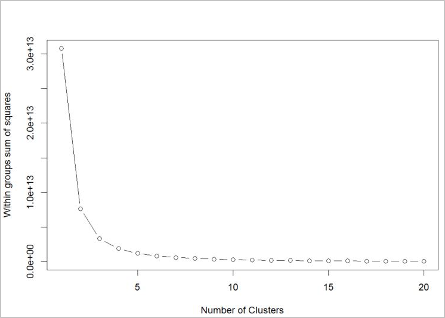

# Tutorial: Build a clustering model in R with SQL machine learning
[!INCLUDE [SQL Server 2016 SQL MI](../../includes/applies-to-version/sqlserver2016-asdbmi.md)]

::: moniker range=">=sql-server-ver15||>=sql-server-linux-ver15"
In part three of this four-part tutorial series, you'll build a K-Means model in R to perform clustering. In the next part of this series, you'll deploy this model in a database with SQL Server Machine Learning Services or on Big Data Clusters.
::: moniker-end
::: moniker range="=sql-server-2017"
In part three of this four-part tutorial series, you'll build a K-Means model in R to perform clustering. In the next part of this series, you'll deploy this model in a database with SQL Server Machine Learning Services.
::: moniker-end
::: moniker range="=sql-server-2016"
In part three of this four-part tutorial series, you'll build a K-Means model in R to perform clustering. In the next part of this series, you'll deploy this model in a database with SQL Server R Services.
::: moniker-end
::: moniker range="=azuresqldb-mi-current"
In part three of this four-part tutorial series, you'll build a K-Means model in R to perform clustering. In the next part of this series, you'll deploy this model in a database with Azure SQL Managed Instance Machine Learning Services.
::: moniker-end

In this article, you'll learn how to:

> [!div class="checklist"]
> * Define the number of clusters for a K-Means algorithm
> * Perform clustering
> * Analyze the results

In [part one](r-clustering-model-introduction.md), you installed the prerequisites and restored the sample database.

In [part two](r-clustering-model-prepare-data.md), you learned how to prepare the data from a database to perform clustering.

In [part four](r-clustering-model-deploy.md),  you'll learn how to create a stored procedure in a database that can perform clustering in R based on new data.

## Prerequisites

* Part three of this tutorial series assumes you have fulfilled the prerequisites of [**part one**](r-clustering-model-introduction.md) and completed the steps in [**part two**](r-clustering-model-prepare-data.md).

## Define the number of clusters

To cluster your customer data, you'll use the **K-Means** clustering algorithm, one of the simplest and most well-known ways of grouping data.
You can read more about K-Means in [A complete guide to K-means clustering algorithm](https://www.kdnuggets.com/2019/05/guide-k-means-clustering-algorithm.html).

The algorithm accepts two inputs: The data itself, and a predefined number "*k*" representing the number of clusters to generate.
The output is *k* clusters with the input data partitioned among the clusters.

To determine the number of clusters for the algorithm to use, use a plot of the within groups sum of squares, by number of clusters extracted. The appropriate number of clusters to use is at the bend or "elbow" of the plot.

```r
# Determine number of clusters by using a plot of the within groups sum of squares,
# by number of clusters extracted. 
wss <- (nrow(customer_data) - 1) * sum(apply(customer_data, 2, var))
for (i in 2:20)
    wss[i] <- sum(kmeans(customer_data, centers = i)$withinss)
plot(1:20, wss, type = "b", xlab = "Number of Clusters", ylab = "Within groups sum of squares")
```



Based on the graph, it looks like *k = 4* would be a good value to try. That *k* value will group the customers into four clusters.

## Perform clustering

In the following R script, you'll use the function **kmeans** to perform clustering.

```r
# Output table to hold the customer group mappings.
# Generate clusters using Kmeans and output key / cluster to a table
# called return_cluster

## create clustering model
clust <- kmeans(customer_data[,2:5],4)

## create clustering ouput for table
customer_cluster <- data.frame(cluster=clust$cluster,customer=customer_data$customer,orderRatio=customer_data$orderRatio,
        itemsRatio=customer_data$itemsRatio,monetaryRatio=customer_data$monetaryRatio,frequency=customer_data$frequency)

## write cluster output to DB table
sqlSave(ch, customer_cluster, tablename = "return_cluster")

# Read the customer returns cluster table from the database
customer_cluster_check <- sqlFetch(ch, "return_cluster")

head(customer_cluster_check)
```

## Analyze the results

Now that you've done the clustering using K-Means, the next step is to analyze the result and see if you can find any actionable information.

```r
#Look at the clustering details to analyze results
clust[-1]
```

```results
$centers
   orderRatio itemsRatio monetaryRatio frequency
1 0.621835791  0.1701519    0.35510836  1.009025
2 0.074074074  0.0000000    0.05886575  2.363248
3 0.004807692  0.0000000    0.04618708  5.050481
4 0.000000000  0.0000000    0.00000000  0.000000

$totss
[1] 40191.83

$withinss
[1] 19867.791   215.714   660.784     0.000

$tot.withinss
[1] 20744.29

$betweenss
[1] 19447.54

$size
[1]  4543   702   416 31675

$iter
[1] 3

$ifault
[1] 0

```

The four cluster means are given using the variables defined in [part two](r-clustering-model-prepare-data.md#separate-customers):

* *orderRatio* = return order ratio (total number of orders partially or fully returned versus the total number of orders)
* *itemsRatio* = return item ratio (total number of items returned versus the number of items purchased)
* *monetaryRatio* = return amount ratio (total monetary amount of items returned versus the amount purchased)
* *frequency* = return frequency

Data mining using K-Means often requires further analysis of the results, and further steps to better understand each cluster, but it can provide some good leads.
Here are a couple ways you could interpret these results:

* Cluster 1 (the largest cluster) seems to be a group of customers that are not active (all values are zero).
* Cluster 3 seems to be a group that stands out in terms of return behavior.

## Clean up resources

If you're not going to continue with this tutorial, delete the tpcxbb_1gb database.

## Next steps

In part three of this tutorial series, you learned how to:

* Define the number of clusters for a K-Means algorithm
* Perform clustering
* Analyze the results

To deploy the machine learning model you've created, follow part four of this tutorial series:

> [!div class="nextstepaction"]
> [Deploy a clustering model in R with SQL machine learning](r-clustering-model-deploy.md)
